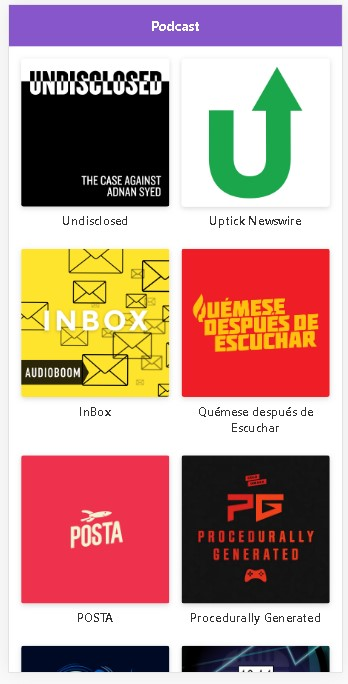
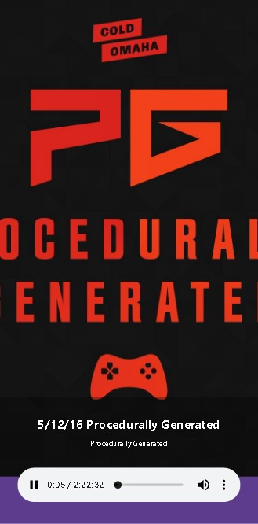

# App Podcats AudioBoom

App de Podcasts integrada con la API de AudioBoom 

Este proyecto fue contruido con:

* **React**
* **Next.JS**
* **Next-Routes**

## Screenshoots:

[Ver la aplicación]()

## ¿Cómo funciona?

Requiere Node.JS 10

* `npm install` para instalar las dependencias.
* `npm run dev src/server/server.js` para correr en desarrollo.
* `npm run build src/server/server.js && npm start` para el correr en producción

## Licencia
MIT